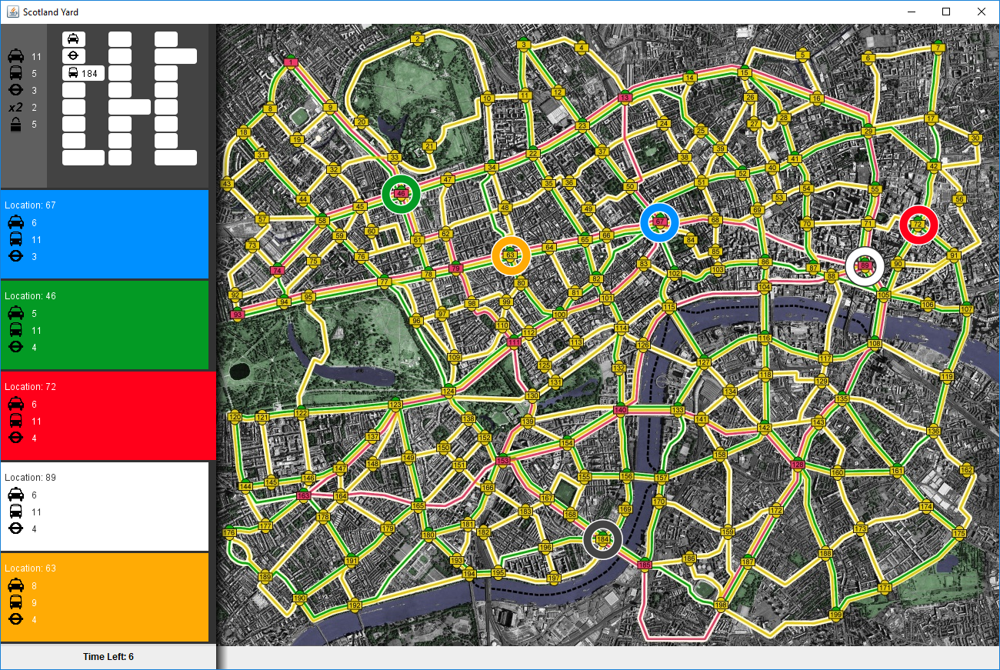

# Scotland Yard

This repository contains a computer game adaptation of the board game [Scotland Yard](https://en.wikipedia.org/wiki/Scotland_Yard_(board_game)) , completed as part of a large programming assignment at the University of Bristol.  

The game can be played locally or online against an AI, implemented using a variety of techniques from game theory and artificial intelligence (see [implementation](Implementation of Mr X) below). 

A previous iteration of this project can be found at <https://github.com/dkeitley/scotlandyardA>.





## Rules of the game

Scotland Yard is a multiplayer board game in which a team of players, acting as detectives, try to track down and capture a criminal (known as Mr X) through the streets of London.  

Mr X's location is only revealed periodically and so the detectives must deduce the whereabouts of Mr X based on previous sightings.  All players move across the board via taxis, buses or using the underground, represented by the yellow, green and red lines respectively.  

To win the game, the detectives must land on the same 'node' as Mr X or surround Mr X so he cannot move.  Conversely, Mr X wins the game if he is able to escape capture for 24 rounds.  

Each detective moves across the board using a limited number of tickets for taxis, buses and the underground.  Mr X also uses these forms of transport, which is displayed to the detectives during each turn, however, Mr X is not restricted by tickets and in addition, has at his disposal a small number of 'special moves'.  Mr X has 2 double-move tickets, which enables him to make 2 double-moves per game. He also has 3 black tickets, which when used, hides the mode of transport used from the detectives. 

A more detailed description of the rules can be found [here](resources/Scotland_Yard_Rules.pdf). 


## Implementation of Mr X

In this project we implemented Mr X as a non-character player which makes moves based on ideas from game theory and artificial intelligence. Concretely, each state of the game is scored using a variety of heuristics including:

- The number of moves it would take the detectives to reach Mr X (computed using a variation of [Dijkstra's algorithm]([https://en.wikipedia.org/wiki/Dijkstra%27s_algorithm](https://en.wikipedia.org/wiki/Dijkstra's_algorithm)))
- The number of valid moves available to Mr X
- The number and spread of possible locations for Mr X, as viewed from the perspective of the detectives.

The weightings given to each of these heuristics were tweaked using a test suite that considered a selection of corner cases and informative scenarios. 

Prior to, and during Mr X's turn, a game tree of possible moves is constructed and a [MiniMax algorithm](<https://en.wikipedia.org/wiki/Minimax#Minimax_algorithm_with_alternate_moves>) is used to determine a suitable action. The addition of [alpha-beta pruning]([https://en.wikipedia.org/wiki/Alpha%E2%80%93beta_pruning](https://en.wikipedia.org/wiki/Alpha–beta_pruning)) enables Mr X to foresee several moves ahead.  We also apply an [iterative deepening](<https://en.wikipedia.org/wiki/Iterative_deepening_depth-first_search>) approach to ensure an optimal move is selected within the 15 second time frame. 

The implementation of these algorithms can be found in the [AIPlayer class](src/player/MyAIPlayer.java). 


## Starting the game...

To run the application, first launch the server by running

```js
node server\server_service.js
```

Next, start the judge service, which initialises the game and validates player moves during the game.

```
ant judge
```

Finally you can add players to the game by connecting to the local server. 

A template game of 5 detectives can be set up by running

```
ant players
```


### Acknowledgements

This assignment was a joint project by Daniel Keitley and Michael Aldridge as part of the Programming & Algorithms II undergraduate course at the University of Bristol.  We would like to thank the Department of Computer Science and teaching staff for providing initial starter code (incl. graphics and GUI design) and for their help and advice during the making of the project. 

